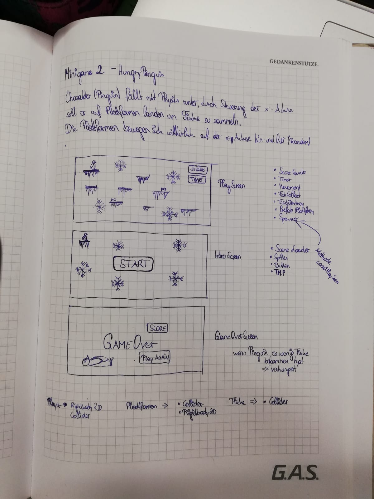

# HungryPenguin

Progress in %:  10% finished 
                Konzept ist fertig 
                Projekt wurde auf GitHub angelegt
                Projekt wurde gecloned
                [Pp]ackages bei .gitignore geadded
                .DSStore bei .gitignore geadded

Bei „HungryPenguin“ ist das Ziel den Pinguin zu füttern, indem man so viele Fische wie möglich sammelt. Der Pinguin kann sich nach links und rechts Bewegen und man muss versuchen ihn so zu steuern, dass er auf einer Plattform mit einem Fisch zu landen kommt.   Jedoch sind die Plattformen kein fixes Element sondern bewegen sich mittels Spawner(Random) ebenfalls auf der x-Achse hin und her. Es gibt aber auch gewisse Plattformen die nach oben schweben, somit kommt man in der Scene wieder nach oben.
Hat man innerhalb der 60sec. weniger als 3 Fische gesammelt, verhungert der Pinguin und man hat das Game verloren. 

Name des Minigames lautet: HungryPenguin
Developmentplattform: Unity Version 2018.2.14f1 
Visualstudio 7.7 
Betriebssystem: macOS Mojave 10.14.1
Targetplattform: Computer 16:9 mit einer Auflösung von 1920,1080 

